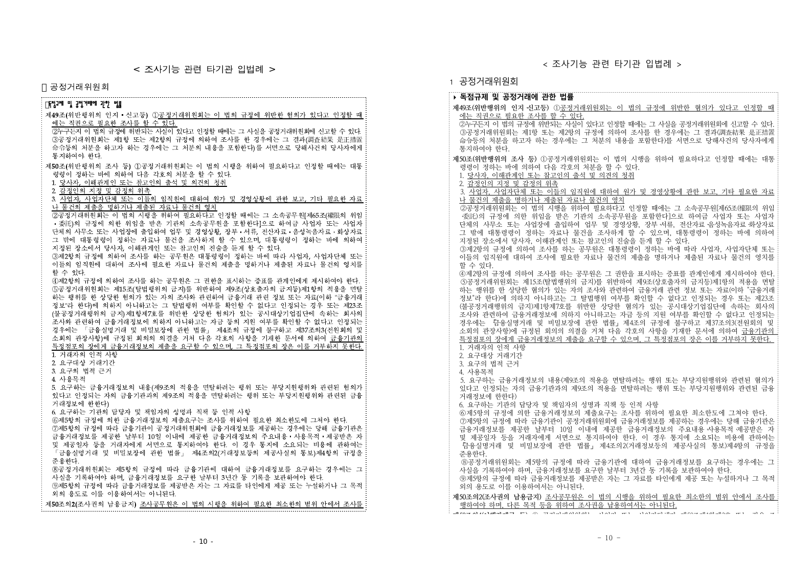

# Task #3820 Stage 18 — 현재 macOS 폰트 환경 p10–p17 PDF 직접 대조

## 목적

이전 Windows `upstream/devel` 재현은 로컬 보정 commit을 포함하지 않았으므로 현재
브랜치의 판정 근거로 사용하지 않는다. 이 Stage는 `task/3820-3821-fidelity`의 현재
head에서, 새로 등록한 한컴 TTF가 보이는 macOS 환경으로 `issue2007` p10–p17을 기준
PDF와 다시 직접 대조한다.

## 기준 및 실행

- 검증 commit: `522b23222` (`task/3820-3821-fidelity`)
- HWP: `samples/basic/issue2007_nested_cell_pagination_42065.hwp`
- 기준 PDF: `pdf/basic/issue2007_nested_cell_pagination_42065-2020.pdf`
- `rhwp info --json`: HWP 17쪽. 기준 PDF와 같은 17쪽이다.
- build: `CARGO_TARGET_DIR=target/task-3820-3821-fidelity`,
  `CARGO_INCREMENTAL=0`, `cargo build --release --bin rhwp`
- export: release CLI로 0-based page `9..16`을 `--profile print` SVG로 새로 생성했다.
- 대조: 같은 실행에서 Poppler 96dpi 기준 PDF PNG(왼쪽)와 `rsvg-convert` SVG PNG(오른쪽)를
  나란히 저장했다.

현재 fontconfig는 `휴먼명조`(`HMKMM.TTF`), `휴먼고딕`(`HMKMG.TTF`), `맑은 고딕`,
`HY견명조`(`HYMJRE.TTF`), `HY견고딕`을 실제 파일로 해석한다. 반면 HWP가 요청하는
`굴림`·`바탕`·`한양신명조`·`한양중고딕` 등의 논리 family는 이 호스트에서 아직 Verdana로
fallback된다. 따라서 아래 결과는 **현재 macOS release SVG raster의 실제 출력**이며, 완전한
글꼴 fidelity 판정과는 분리한다.

## 페이지별 결과

| 페이지 | PDF 기준과의 직접 대조 | 판정 |
| --- | --- | --- |
| 10 | 종전의 대형 상단 공백 없이 외곽 dotted frame과 법령 본문이 같은 페이지에 연속으로 배치됐다. 다만 PDF의 빈 사각 bullet이 `1`로 바뀌었다. | 구조 회복, bullet 결함 잔존 |
| 11 | nested frame과 하단 `국세청` 시작이 복원됐고 text clip/중첩이 없다. PDF의 빈 사각 bullet은 `2`가 됐다. | 구조 회복, bullet 결함 잔존 |
| 12 | frame 경계와 페이지 내 본문 흐름이 PDF와 대응한다. PDF의 빈 사각 bullet은 `3`이 됐다. | 구조 회복, bullet 결함 잔존 |
| 13 | 이전의 넘어온 테두리·본문 clip 없이 단일 페이지 frame으로 배치됐다. PDF의 빈 사각 bullet은 `4`가 됐다. | 구조 회복, bullet 결함 잔존 |
| 14 | continuation frame과 `금융위원회` 본문이 PDF와 같은 페이지에 유지된다. PDF의 빈 사각 bullet은 `6`이 됐다. | 구조 회복, bullet 결함 잔존 |
| 15 | 상위 테두리 및 본문이 잘리지 않고 유지된다. PDF의 빈 사각 bullet은 `7`이 됐다. | 구조 회복, bullet 결함 잔존 |
| 16 | 본문과 목록이 같은 페이지에서 연속되며 잘림이나 frame 이탈이 없다. | 구조 통과 |
| 17 | `3)`과 `4)` 내용이 모두 보이며 조기 빈 페이지나 누락이 없다. | 구조 통과 |

나머지 p11–p17의 같은 형식 증적도
[`mydocs/pr/assets/task_m100_3820_stage18_current_macos_font_validation/`](../pr/assets/task_m100_3820_stage18_current_macos_font_validation/)에 보관한다.

## 남은 구현 범위

페이지 수·nested-table continuation·p17 본문 누락은 이 현재 실행에서 해소됐다. 그러나
p10–p15의 최상위 빈 사각 bullet이 순번(`1`·`2`·`3`·`4`·`6`·`7`)으로 바뀌는 것은 글꼴
fallback과 무관한 의미/형태 fidelity 결함이다. 다음 구현 Stage는 이 항목의 source character와
번호 목록 변환 경로를 분리해 수정·회귀화한다. 논리 font family alias도 별도 환경 재현성 항목으로
추적한다.
